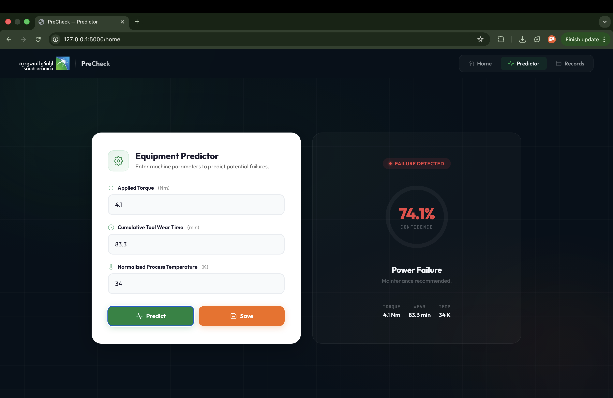
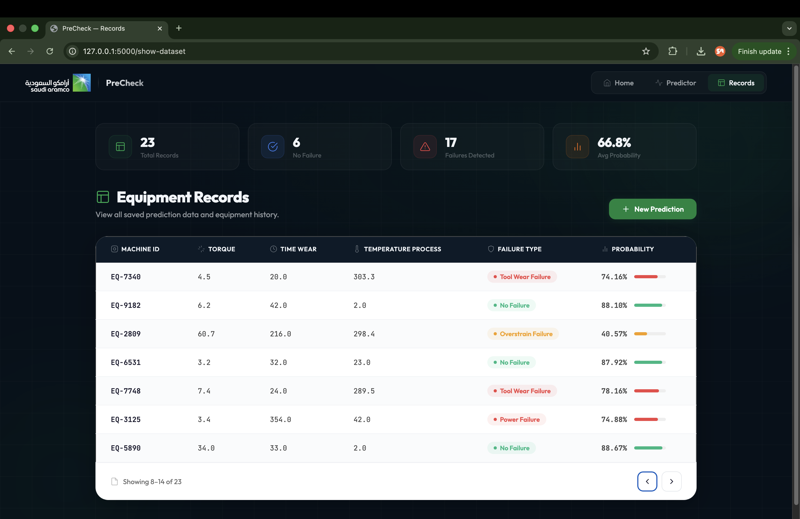

<div align="center">

# Machine Failure Prediction System ⚙️

<p>
  
  &nbsp;
  
  &nbsp;
  
  &nbsp;
  
  &nbsp;
</p>

A proactive AI tracking system that predicts potential **machine failures** before they occur — built during a 2-month summer training at **Aramco's Distribution Projects Division** to enhance safety, reduce downtime, and optimize maintenance in industrial operations.

</div>

---

<div align="center">
  
</div>

<p align="center">
  
  
  
</p>

---

## 📌 About The Project

In Aramco's Distribution Projects Division, equipment was frequently used without proper pre-use checks — leading to unexpected failures, safety risks, project delays, and increased maintenance costs.

**PreCheck** solves this by leveraging machine learning to analyze equipment parameters (torque, tool wear time, process temperature) and predict whether a machine will fail — and what type of failure to expect — before it happens. The system was built end-to-end: from data analysis and model training to a full web interface accessible to non-technical stakeholders.

### ✨ Key Features

| Feature | Description |
|:--|:--|
| **Failure Prediction Engine** | Input machine parameters and receive real-time predictions on failure type and probability |
| **Multi-Class Classification** | Detects 5 failure types: Heat Dissipation, Power, Overstrain, Tool Wear, and Random Failures |
| **Equipment Records Database** | Save predictions with Equipment IDs and browse historical records with pagination |
| **User-Friendly Web Interface** | Built for non-technical users with a How-to-Use guide, FAQs, and clean navigation |

---

## 🏆 Results & Performance

| Metric | Score |
|:--|:--|
| Final Model | **BalancedRandomForestClassifier** |
| F1 Score | **89%** |
| Geometric Mean Score | **89%** |
| Failure Types Detected | **5 categories** |

The model was selected after experimenting with SVM, Neural Networks (MLPClassifier), and Ensemble Methods (ExtraTreeClassifier), then optimized via GridSearchCV hyperparameter tuning with cross-validation to ensure robustness and generalization.

---

## 🛠️ Built With

<p align="center">
  
  
  
  
  
  
  
</p>

| Layer | Technology | Role |
|:--|:--|:--|
| **ML Model** | Python, scikit-learn | BalancedRandomForestClassifier with SMOTEENN, PCA, GridSearchCV |
| **Backend** | Flask | API endpoints, model integration, data storage & retrieval |
| **Frontend** | HTML, CSS, JavaScript | Responsive UI with predictor form, results display, and records table |
| **Data Analysis** | Python, Google Colab | EDA, feature engineering, visualization, model experimentation |

---

## 🏗️ Architecture

```
┌─────────────────────────────────────────────────┐
│           Frontend (HTML / CSS / JS)            │
│    Main Page · Predictor · Records · FAQs       │
└──────────────────────┬──────────────────────────┘
                       │
              ┌────────▼────────┐
              │  Flask Backend  │
              │  API · Routing  │
              │  Data Storage   │
              └────────┬────────┘
                       │
              ┌────────▼────────┐
              │   ML Pipeline   │
              │ ┌─────────────┐ │
              │ │Preprocessing│ │
              │ │ SMOTEENN +  │ │
              │ │ PCA + Scale │ │
              │ └─────────────┘ │
              │ ┌─────────────┐ │
              │ │  Balanced   │ │
              │ │ RandomForest│ │
              │ │ Classifier  │ │
              │ └─────────────┘ │
              └────────┬────────┘
                       │
              ┌────────▼────────┐
              │    Prediction   │
              │ Failure Type +  │
              │  Probability    │
              └─────────────────┘
```

---

<div align="center">


&nbsp;

&nbsp;

&nbsp;

&nbsp;

&nbsp;


</div>
